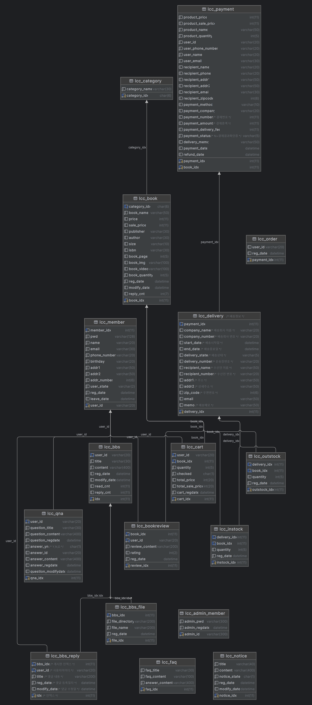
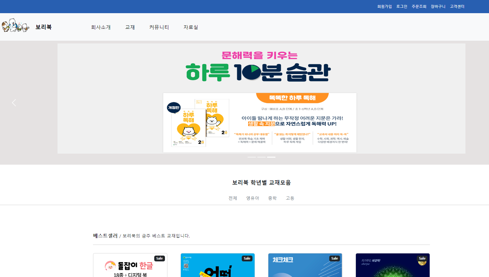

# 보리북 도서 쇼핑몰
초등, 중등, 고등학생을 대상으로 하는 도서 쇼핑몰을
Java Spring MVC패턴으로 구현

## 구성 인원
이재선, 채종윤, 최세아

## 프로젝트 기간
2024.04.24 ~ 2024.05.03(예정)

## 개발 환경
Tomcat(9.x), JDK(11), Intellij, mariadb
## 라이브러리 및 프레임워크
jstl, jquery, junit, spring, mybatis, lombok, log4j, HikariCP, mariadb, hibernate, modelmapper, commons-fileupload, commons-io, aspectjrt, aspectjweaver, cglib, jackson-databind

## 발표 순서
이재선, 최세아, 채종윤

## 발표 내용
프로젝트 개요, DB ERD, 구현 결과물, Q&A

## DB Schema

## Preview

